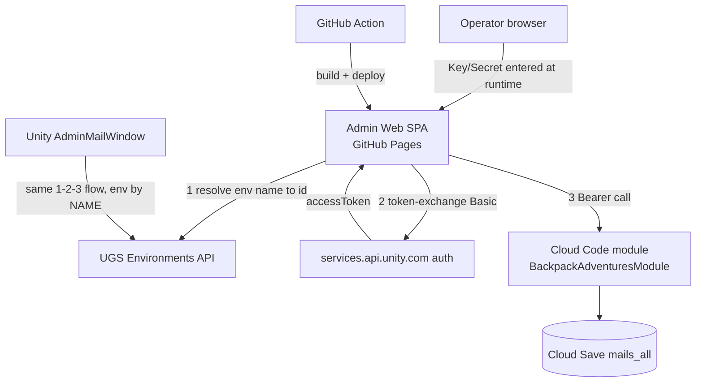

# Devlog_AdminWeb_Mailbox

## Status

- Current phase: **Execution complete (Tasks 1-5 done, integration-reviewed) → PO review + GUIDs pending**
- Owner: Claude (AI Orchestration Tech Lead) — PO: Ninh
- Last updated: 2026-06-01

---

## Problem & Product Goal

Provide an **Admin Web** dashboard that mirrors the Unity Editor `AdminMailWindow`
("CloudCode > Admin Mail") so operators can manage in-game mail from a browser
without opening the Unity Editor. Additionally, simplify environment selection so
operators type an environment **name** (`production` / `testing`) instead of a
GUID, and apply the same simplification to the Unity editor for parity.

**Product goal:** non-Unity operators can send global/targeted mail, and manage
(list / edit / delete) global mails in Cloud Save, from a deployed web page.

---

## Solution Direction (PO-approved 2026-06-01)

| Decision | Choice |
|---|---|
| Web architecture | **Static SPA**, operator enters service-account Key/Secret at runtime (sessionStorage, never committed). Browser calls UGS token-exchange + Cloud Code REST directly. Proxy only if CORS blocks. |
| Deploy target | **GitHub Pages** in the `UnityCloudCode` repo |
| Env name→ID | **Live UGS API resolution** (same pattern as existing `deploy.yml` lines 187-200) — applied in BOTH the web and the editor |

---

## Scope

1. **Admin Web SPA** (`Assets/UnityCloudCode/AdminWeb/`) — Send (global + targeted)
   and Manage (list / set end time / expire / delete) global mails; attachments with
   `AssetType` (Currency/Item); environment entered by **name**.
2. **UnityClient editor parity** — `AdminMailWindow.cs`: replace Environment **ID**
   field with Environment **name**; resolve name→ID via UGS API before token-exchange.
3. **GitHub Actions deploy workflow** — build the SPA and publish to GitHub Pages.

## Non-Scope

- No changes to the Cloud Code server modules' mail logic or schema.
- No new GitHub secrets beyond what Pages needs (none for service creds — they are
  entered at runtime by the operator).
- No player-facing client changes; no DOTS/ECS work.
- Gift/User mailbox player flows beyond what the editor already exposes.

---

## Grounding (verified from code, 2026-06-01)

**Repo:** `Assets/UnityCloudCode` is a standalone git repo/submodule
(`github.com-personal:dyCuong03/UnityCloudCode.git`) with its own `.github/`.
The web + deploy workflow live **inside this submodule**, not the Unity project root.

**Cloud Code mail endpoints** (`CloudCodeModule/BackpackAdventuresModule~/Mailbox/`):

| Endpoint | Input (request) | Output |
|---|---|---|
| `SendGlobalMail` | `{ subject, body, expiresAt?, attachments?, targetUserIds?, dedupKey?, adminToken?, operatorId }` | `{ globalMailId, sentAt }` |
| `GetGlobalMails` | `{ page, pageSize }` | `{ mails[], totalCount, page, pageSize, hasMore }` |
| `SetMailEndTime` | `{ mailId, endTime, operatorId }` | `{ mailId, endTime }` |
| `ExpireMail` | `{ mailId, operatorId }` | `{ mailId, expiredAt }` |
| `DeleteGlobalMail` | `{ mailId, operatorId }` | `{ mailId }` |
| `PurgeExpired` | `{ operatorId }` | `{ purgedCount, purgedAt }` |

**Mail record** (Cloud Save key `mails_all`, stored as `{ Mails: [{ Mail }] }`):
`Mail { MessageId, TargetUserIds?:string[]|null, Title, Content, StartTime, EndTime?:DateTime|null, Attachments: Payout[] }`
`Payout { PayoutAssetId, Chance:double, AssetType:"Currency"|"Item", PayoutAmount:int }`

**Attachment over the wire** (`MailAttachment` in `UnityClient/Runtime/CloudCodeModels.cs`):
`{ type:"currency"|"item", id, itemId, amount, quantity }` — server maps to `Payout`.

**Auth / call pattern** (mirror exactly; already proven in `deploy.yml`):
1. Resolve env name → env ID via UGS env list/Environments API.
2. `POST https://services.api.unity.com/auth/v1/token-exchange?projectId={pid}&environmentId={eid}`
   with `Authorization: Basic base64(keyId:secret)` and body `{"scopes":[]}` → `{ accessToken }`.
3. `POST https://cloud-code.services.api.unity.com/v1/projects/{pid}/modules/BackpackAdventuresModule/{endpoint}`
   with `Authorization: Bearer {accessToken}`, body `{ "params": { "request": {...} } }`.
   Response envelope: `{ output: { StatusCode, Message, Data } }` (unwrap `Data`).

**Editor today** (`UnityClient/Editor/CloudCodeFeature/AdminMailWindow.cs`):
collects Project ID, **Environment ID (GUID)**, Service Key ID, Service Secret,
Operator ID; tabs Send Global / Send Targeted / Manage; attachments use
`enum AssetTypeOption { Currency, Item }`. Env ID flows TextField → EditorPrefs
(`BackpackAdventures.AdminMail.EnvironmentId`) → `EditorRestCloudCodeBackend` →
token-exchange URL `environmentId=` param.

---

## High-Level Technical Design



### Web/Editor shared contract (so workstreams stay parallel)

| Item | Value |
|---|---|
| Web app dir | `Assets/UnityCloudCode/AdminWeb/` |
| Stack | Vite + TypeScript (vanilla, no UI framework required); zero runtime backend |
| Build | `npm ci && npm run build` → output `AdminWeb/dist/` |
| Pages base | configurable `base` in `vite.config.ts` (repo-name path) |
| Module name | `BackpackAdventuresModule` |
| Env input | free-text name (`production`/`testing`), resolved live to ID |
| Creds storage | `sessionStorage` only; cleared on logout; never written to disk/repo |
| Endpoints used | SendGlobalMail, GetGlobalMails, SetMailEndTime, ExpireMail, DeleteGlobalMail, PurgeExpired |

---

## Implementation Plan

| Step | Task | Owner/Agent | Output | Status |
|---|---|---|---|---|
| 1 | Admin Web SPA (send + manage + attachments + env-by-name) | web-dev (sonnet) | `AdminWeb/` Vite app | ✅ Done |
| 2 | Editor parity: env name instead of GUID in `AdminMailWindow` | unity-dev (sonnet) | edited `AdminMailWindow.cs` + helper | ✅ Done |
| 3 | GitHub Pages deploy workflow + docs | devops (sonnet) | `.github/workflows/deploy-adminweb.yml` | ✅ Done |
| 4 | Integration review, CORS verification, docs sync | lead (opus) | review notes, Devlog update | Pending PO |

## Agent Allocation

| Agent | Model | Responsibility | Acceptance Criteria |
|---|---|---|---|
| web-dev | sonnet | Build `AdminWeb/` SPA mirroring AdminMailWindow | All 6 endpoints callable; Send + Manage tabs; attachments with AssetType; env by name; creds session-only; `npm run build` produces `dist/` |
| unity-dev | sonnet | Editor env name parity | Editor field is Environment **Name**; resolves to ID via UGS API; token-exchange still works; EditMode compiles; no other behavior changed |
| devops | sonnet | Deploy workflow → GitHub Pages | Workflow builds `AdminWeb` and deploys `dist/` to Pages on push + manual; no service-account secrets required; does not modify existing `deploy.yml` |

---

## Testing Plan

- **Web**: `npm run build` succeeds; manual smoke against a real env (operator creds);
  CORS verified against `services.api.unity.com` early (top risk). Mock/stub layer so
  the UI can be exercised without live creds.
- **Editor**: project compiles; AdminMailWindow opens; name resolves; existing EditMode
  mailbox tests unaffected.
- **CI**: workflow validated via `act`/dry pattern or by structure review; Pages
  artifact upload step present.

## Issues & Risks

| Risk | Likelihood | Impact | Mitigation |
|---|---|---|---|
| Browser CORS blocked by UGS services API | Medium | HIGH (breaks static-SPA model) | **Verified**: auth + CC endpoints CORS OK; only Environments API CORS-blocked. SPA handles with UUID fallback + warning. |
| Service secret exposure in browser | By design (internal tool) | Medium | Session-only, never persisted/committed; same trust model as editor; warn in UI |
| Env name→ID API shape differs from CLI | Low | Medium | Reuse `deploy.yml` resolution pattern; fall back to `ugs env list` semantics |
| GitHub Pages base path / SPA routing | Low | Low | Set `base` in vite config; hash routing if needed |

## Execution Notes

### 2026-06-01 — devops: GitHub Pages deploy workflow created (Task #3)

**Files created/modified:**

| File | Action |
|---|---|
| `.github/workflows/deploy-adminweb.yml` | Created — GitHub Pages build + deploy workflow |
| `README.md` | Updated — added "Admin Web" section (Pages setup, URL, trigger, build contract, security model) |

**Workflow summary:**

- **Triggers:** `push` to `main`/`staging` filtered to `AdminWeb/**` and the workflow file itself; `workflow_dispatch`.
- **Permissions:** `contents: read`, `pages: write`, `id-token: write`.
- **Concurrency:** group `pages`, `cancel-in-progress: true`.
- **Build job:** `actions/checkout@v4` → `actions/setup-node@v4` (Node 20, npm cache keyed on `AdminWeb/package-lock.json`) → `npm ci` → `npm run build` (both with `working-directory: AdminWeb`) → `actions/upload-pages-artifact@v3` (`path: AdminWeb/dist`).
- **Deploy job:** `needs: build`, environment `github-pages`, `actions/deploy-pages@v4`. Outputs page URL in job summary.
- **No service-account secrets** required by this workflow; creds are operator-entered at runtime.

**Required one-time repo setup:** GitHub repo → Settings → Pages → Source = **GitHub Actions**.

**Vite base path coordination with web-dev:**
Recommended `base: '/UnityCloudCode/'` in `vite.config.ts` — this matches the GitHub Pages subdirectory (`https://dycuong03.github.io/UnityCloudCode/`). Alternative: `base: './'` works if absolute asset paths are not needed (simpler but limits deep-route navigation). Message sent to web-dev with recommendation.

**Existing `deploy.yml` untouched** — the Cloud Code module deploy workflow is unmodified.

### 2026-06-01 — unity-dev: Editor env-name parity (Task #2)

**What changed** in `UnityClient/Editor/CloudCodeFeature/AdminMailWindow.cs`:

| Area | Old | New |
|---|---|---|
| EditorPrefs key | `BackpackAdventures.AdminMail.EnvironmentId` (GUID) | `BackpackAdventures.AdminMail.EnvironmentName` (name string) |
| UI field label | "Environment ID" | "Environment Name" |
| Window fields | `_environmentId` | `_environmentName` + `_resolvedEnvironmentId` + `_resolvedForName` |
| Migration | — | `OnEnable` reads new key; falls back to old GUID key if empty |
| Resolution | — | `ResolveEnvironmentIdAsync()` caches per session; called before each action |
| `UseRestBackend()` | Parameterless | `UseRestBackend(string resolvedEnvId)` |
| New static helper | — | `EditorRestCloudCodeBackend.ResolveEnvironmentIdAsync(projectId, envName, keyId, secret)` |

**Resolution endpoint**: `GET https://services.api.unity.com/unity/v1/projects/{projectId}/environments`
Auth: `Authorization: Basic base64(keyId:secret)`.
Expected response: `{ "results": [ { "id": "<UUID>", "name": "<string>" } ] }`.

**Confidence**: Medium-high. Endpoint from task spec; corroborated by UGS CLI source code (`Unity.Services.Gateway.IdentityApiV1`, `unity/v1` path) and UGS admin-auth docs (Basic auth confirmed). `results` key from CLI `EnvironmentService.ListAsync`. Implementation also tolerates `"environments"` root key for resilience; surfaces raw body on unexpected shape.

**Compile safety**: Manual review — no stray window-level `_environmentId` references; all 5 action methods updated; `EditMode` tests untouched (zero references to `AdminMailWindow`).

**MCP verify**: Unity MCP unavailable this session. Manual diff review used.

### 2026-06-01 — unity-dev: Editor env config-map as primary (Task #5)

**Context:** After web-dev confirmed `services.api.unity.com/environments/v1` is CORS-blocked (no CORS headers), PO chose a static name→GUID config-map as the primary resolution strategy for the SPA. For parity and to remove editor reliance on the unverified `/unity/v1/projects/.../environments` endpoint, the same map was added as primary in the editor.

**Changes to `AdminMailWindow.cs`:**

Added `EnvironmentNameMap` (static, `StringComparer.OrdinalIgnoreCase`) and `LooksLikeUuid` helper. `ResolveEnvironmentIdAsync` now applies a 3-step order:

1. If `_environmentName` already looks like a UUID (len 36, dashes at 8/13/18/23) → use directly, no network call.
2. Map lookup (case-insensitive). If a key matches and the stored value is not a placeholder (`<FILL...>`) → use the GUID, skip network.
3. Fallback: existing `EditorRestCloudCodeBackend.ResolveEnvironmentIdAsync` live API call.

**GUIDs:** Placeholders `<FILL_PRODUCTION_ENV_GUID>` / `<FILL_TESTING_ENV_GUID>` — pending PO input. Map lookup skips to live fallback while placeholders are unfilled.

**Map keys (agreed standard, pending web-dev confirmation):**
`"production"` and `"testing"` (lowercase, case-insensitive lookup). Must be identical in editor and SPA.

**Fallback endpoint — open question (pending web-dev reply):**
Editor has: `GET https://services.api.unity.com/unity/v1/projects/{projectId}/environments`
Web used: `GET https://services.api.unity.com/environments/v1/...` (exact path TBD from web-dev)
Both are unverified / CORS-irrelevant in editor context. Will sync to one URL once web-dev responds.

**Compile safety:** Manual review. `Dictionary<string, string>` uses existing `System.Collections.Generic` import.

### 2026-06-01 — web-dev: Admin Web SPA built (Task #1)

**CORS verification (curl OPTIONS, 2026-06-01):**

| Endpoint | CORS | Notes |
|---|---|---|
| `services.api.unity.com/auth/v1/token-exchange` | ✅ `access-control-allow-origin: *` | Auth works directly from browser |
| `cloud-code.services.api.unity.com` | ✅ `access-control-allow-origin: *` | All Cloud Code calls work directly |
| `services.api.unity.com/environments/v1` | ❌ No CORS headers | Env name→ID resolution BLOCKED |

**Env name resolution mitigation**: Input accepts UUID directly (bypasses API) or env name (attempts API, falls back with warning on CORS TypeError). `apiConfig.envBase` is configurable for proxy. Warning shown in sidebar if resolution failed.

**Files created:**

| File | Description |
|---|---|
| `AdminWeb/package.json` | Vite + TypeScript devDependencies |
| `AdminWeb/package-lock.json` | Generated by `npm install` |
| `AdminWeb/tsconfig.json` | TS compiler config |
| `AdminWeb/vite.config.ts` | Vite config; `base` via `VITE_BASE` env var (default `'./'`) |
| `AdminWeb/index.html` | SPA shell |
| `AdminWeb/src/types.ts` | TypeScript DTOs mirrored from CloudCodeModels.cs |
| `AdminWeb/src/api.ts` | API abstraction: credentials (sessionStorage), env resolve, token exchange, callCloudCode core + 6 wrappers |
| `AdminWeb/src/main.ts` | Full UI: connection form, Send Global/Targeted, Manage (list + inline edit), attachments editor, status |
| `AdminWeb/src/style.css` | Dark-theme stylesheet |
| `.gitignore` | Added `AdminWeb/node_modules/` and `AdminWeb/dist/` |

**Build:** `cd AdminWeb && npm ci && npm run build` → `AdminWeb/dist/` ✅ clean (tsc + vite, no errors/warnings)

**Feature coverage:**
- Connection form: Project ID, Environment (name or UUID), Service Key ID, Service Secret (session-only), Operator ID. Connect validates via token exchange. Logout/Clear wipes all sessionStorage + in-memory secret.
- Send Global tab: Subject, Body (1-1024), ExpiresAt (null or UTC with +1d/+7d/+30d presets), Category, SenderName, DedupKey, Attachments editor.
- Send Targeted tab: above + Target User IDs dynamic list.
- Attachments editor: rows of {PayoutAssetId, AssetType (Currency|Item), PayoutAmount:int, Chance:0-1} → mapped to `MailAttachment {type, id, itemId, amount, quantity}` wire format (matches C# `BuildAttachments()`).
- Manage tab: GetGlobalMails paged list with inline per-row Set EndTime / Expire / Delete; direct operations panel (Mail ID + Set EndTime + Expire + Delete); PurgeExpired section.
- Status bar: success/error/warning/info alerts + raw server response JSON (collapsible).
- API layer: single `callCloudCode` core; proxy-able via `apiConfig.*` base URLs; token cached 5 min in memory only.

**Proxy hook:** `apiConfig.authBase`, `apiConfig.cloudCodeBase`, `apiConfig.envBase` in `src/api.ts`.

**Coordination with devops:** Default `base: './'` (relative). For Pages: `VITE_BASE=/UnityCloudCode/ npm run build`. Message sent to devops.

**Open risks:**
- Env name→ID CORS-blocked from browsers; operators must paste UUID or use proxy. UI shows clear warning.
- Service secret is memory-only; tab close wipes it (by design).
- Mail list field casing (Pascal vs camel) handled tolerantly; verify against live env.

### 2026-06-01 — web-dev: Config-map env resolution (Task #4)

**PO decision:** resolve "production"/"testing" names via a build-time config map instead of a live API call.

**Files added/modified:**

| File | Change |
|---|---|
| `AdminWeb/src/envMap.ts` | New — exports `ENV_MAP` (built from `VITE_ENV_PRODUCTION` / `VITE_ENV_TESTING` at build time, placeholder strings as fallback) and `lookupEnvMap()` helper |
| `AdminWeb/src/api.ts` | `resolveEnvId()` updated to 3-step order; imports `lookupEnvMap` |
| `AdminWeb/tsconfig.json` | Added `"types": ["vite/client"]` so `import.meta.env` type-checks |
| `AdminWeb/src/main.ts` | Env field hint text updated to mention `envMap.ts` / `VITE_ENV_*` |

**Resolution order in `resolveEnvId()`:**
1. UUID input → use directly (no network, no map)
2. Case-insensitive `ENV_MAP` lookup → if value is a real UUID, use it (zero network — covers "production" and "testing" once GUIDs are filled)
3. Live `GET /environments/v1/…` with Basic auth → CORS-blocked from browser; falls back to warning with updated text directing operators to fill the map or use UUID directly

**Config map wiring:**
```ts
// src/envMap.ts
export const ENV_MAP: Record<string, string> = {
  production: import.meta.env['VITE_ENV_PRODUCTION'] || '<PROD_ENV_GUID>',
  testing:    import.meta.env['VITE_ENV_TESTING']    || '<TEST_ENV_GUID>',
}
```
GUIDs pending from PO. Ship with placeholders; operators set `VITE_ENV_*` at build time or edit the file directly. Placeholders (`<...>`) are detected by `lookupEnvMap()` and treated as "not yet filled" → falls through to live API attempt.

**Live-fallback URL:** `/environments/v1/…` (same as before, on `services.api.unity.com`).
Note: unity-dev's editor helper uses `/unity/v1/…` — the two paths differ. Both are CORS-blocked from browsers, so the fallback is moot for the two known envs once the map is filled. Alignment deferred to team-lead review.

**Build result:** ✅ clean (`tsc && vite build`, 7 modules, no errors/warnings)

**Remaining risk:** GUIDs still pending from PO. Until filled, "production" and "testing" names fall through to live API (CORS-blocked) and produce the updated warning. Paste UUID as immediate workaround.

### 2026-06-01 — team-lead: Integration review (Task #4 lead pass)

Reviewed all five tasks directly. Resolutions applied:

- **Live-fallback URL aligned**: both clients now use `GET https://services.api.unity.com/unity/v1/projects/{projectId}/environments` (web-dev switched from `/environments/v1/…` to `/unity/v1/…`; editor already used it). Chosen because the `unity/v1` base is corroborated by the UGS CLI `IdentityApiV1`. Marked **unverified live** in both.
- **Stale comment fixed**: `AdminWeb/src/api.ts:113` doc-comment still referenced `/environments/v1/…` after the switch — corrected to `/unity/v1/…` (comment-only; `dist/` bundle unaffected).
- **Env-map parity confirmed**: keys `production`/`testing` (lowercase, case-insensitive) identical in both clients; both treat unfilled placeholders as no-ops and skip to the live fallback.
- **AssetType attachment flow verified** in `main.ts`: dropdown Currency/Item → `{ type:'currency'|'item', id, itemId, amount, quantity }` (matches C# `BuildAttachments()`), with `PayoutAmount>0` / `Chance>0` validation. Satisfies the "enter AssetType and all is fine" requirement.
- **Build**: `AdminWeb/dist/` rebuilt clean (tsc + vite, no errors/warnings).

**Caveat — placeholder text differs between clients** (cosmetic only; both are detected as unfilled):
- Editor: `<FILL_PRODUCTION_ENV_GUID>` / `<FILL_TESTING_ENV_GUID>`
- Web: `<PROD_ENV_GUID>` / `<TEST_ENV_GUID>` (or `VITE_ENV_PRODUCTION` / `VITE_ENV_TESTING` at build)
The two GUIDs must be filled in **both** places.

## Verification Results

| Check | Result |
|---|---|
| Web SPA `npm run build` → `dist/` | ✅ Clean (tsc + vite, no errors/warnings) |
| All 6 mail endpoints wired (Send/Get/SetEndTime/Expire/Delete/Purge) | ✅ Present in `api.ts` |
| Attachment AssetType (Currency/Item) → wire shape | ✅ Correct, validated |
| Creds session-only; secret never persisted | ✅ Verified (`api.ts` SS keys exclude secret; in-memory token only) |
| Editor env-name field + name→ID resolution | ✅ Code-correct; migration from old GUID pref key handled |
| Editor + web env-map keys/order parity | ✅ Aligned |
| Live-fallback resolver URL single across clients | ✅ `/unity/v1/projects/{id}/environments` |
| Deploy workflow builds + publishes `dist/` to Pages | ✅ Structurally correct; existing `deploy.yml` untouched |
| **Live smoke test against real UGS env** | ⏳ **PENDING — needs operator service-account creds** |
| **UGS Environments `/unity/v1` endpoint live-confirmed** | ⏳ **PENDING — unverified; fails loudly if wrong** |
| Unity compile / EditMode tests via MCP | ⏳ Unity MCP unavailable this session — manual review only |

## Final State

**Status: Implementation complete and integration-reviewed. Awaiting PO inputs for final sign-off.**

All five tasks accepted: #1 SPA, #2 editor parity, #3 deploy workflow, #4 web config-map, #5 editor config-map.

**Deliverables (uncommitted, in working tree of the `UnityCloudCode` submodule):**
- `AdminWeb/` — Vite + TS static SPA (send global/targeted, manage list/edit/delete, attachments w/ AssetType, env by name, session-only creds)
- `UnityClient/Editor/CloudCodeFeature/AdminMailWindow.cs` — env **name** input + name→ID config-map (primary) + live API (fallback)
- `.github/workflows/deploy-adminweb.yml` — GitHub Pages build+deploy
- `README.md` — Admin Web section

**Remaining items (all require PO / external action — cannot be done in-session):**
1. **Provide the two environment GUIDs** for `production`/`testing`; fill the editor map + set `VITE_ENV_*` (or edit `envMap.ts`). Until then, name resolution falls through to the CORS-blocked live API and shows the paste-UUID warning.
2. **Live smoke test** with real service-account creds: confirms (a) the `/unity/v1/.../environments` endpoint, (b) token-exchange + all mail ops, (c) the mail-list field casing.
3. **Enable GitHub Pages**: repo Settings → Pages → Source = GitHub Actions.
4. **Commit/push** in the `UnityCloudCode` submodule (left uncommitted per protocol). ⚠️ The submodule working tree has large pre-existing churn (e.g. `deploy.yml`, `.idea/*`, line-ending diffs) unrelated to this task — review carefully and stage only the AdminWeb/editor/workflow/README changes.

---

### 2026-06-01 — unity-dev: Security + consistency review (Task #8)

**RESULT: CLEAN — all 6 checks pass. One advisory note (non-blocking).**

| # | Check | Result | Evidence |
|---|---|---|---|
| 1 | No UGS Key/Secret in SPA bundle | ✅ CLEAN | Only `VITE_PROXY_URL` in bundle. "secret" hit = UI label "(non-secret — override build default)". "credential" hits = generic JS fetch API string + "credentials cleared" UI text. No `services.api.unity.com`, no `token-exchange`, no `serviceKeyId/serviceSecret`, no `envMap`, no `EnvironmentNameMap` in `dist/assets/*.js`. |
| 2 | Proxy gate: 401 without/wrong token; secrets never returned | ✅ PASS | Line 216 uses `await timingSafeEqual(bearerToken, env.ADMIN_PROXY_TOKEN)` (SHA-256 digest comparison — timing-safe). Error catch block triple-`.replaceAll`s all three secrets (`KEY`, `SECRET`, `ADMIN_PROXY_TOKEN`) before returning the message. No secret value can appear in any response body. |
| 3 | CORS restricted to `ALLOWED_ORIGIN` | ✅ PASS ⚠️ advisory | `corsHeaders()` uses `allowedOrigin \|\| '*'`. `ALLOWED_ORIGIN` is set from `vars.ADMIN_PROXY_ALLOWED_ORIGIN` in `deploy-proxy.yml`. **Advisory:** if that variable is unset on first deploy, CORS falls back to `*`. Not a blocker (token gate still protects `/api/cloudcode`) but operator must set `ADMIN_PROXY_ALLOWED_ORIGIN` before going live. |
| 4 | All 6 endpoints reachable through proxy; `{params:{request}}` shape | ✅ PASS | `api.ts` exports all 6 wrappers: `SendGlobalMail`, `GetGlobalMails`, `SetMailEndTime`, `ExpireMail`, `DeleteGlobalMail`, `PurgeExpired`. `callCloudCode` sends `{ projectId, environment, moduleName, endpoint, request }` to the proxy; worker builds `{ params: { request: ccRequest ?? {} } }` for Cloud Code. Envelope unwrap: `output.Data ?? output.data ?? output`. |
| 5 | Workflows: no secret in bundle; `deploy.yml` untouched; proxy secrets from repo secrets only | ✅ PASS | `deploy-adminweb.yml` injects only `VITE_BASE` (literal) and `VITE_PROXY_URL` (from `vars.*`, non-secret). `deploy.yml` (Cloud Code) has no AdminWeb/proxy references (grep clean, 257 lines, header still "Deploy Cloud Code Modules"). `deploy-proxy.yml` sets `UNITY_PROJECT_SERVICE_ACCOUNT_KEY`, `UNITY_PROJECT_SERVICE_ACCOUNT_SECRET`, `ADMIN_PROXY_TOKEN` from `secrets.*` via wrangler `secrets:` list; `ALLOWED_ORIGIN` from `vars.*`. |
| 6 | AdminWeb + proxy self-contained | ✅ PASS | `api.ts` imports only from `./types` (local DTOs). No imports from `CloudCodeModule`, Unity scripts, or any non-`AdminWeb/` path. |

**Advisory (non-blocking):** Set `ADMIN_PROXY_ALLOWED_ORIGIN` repo variable before deploying to production. If unset, the Worker CORS header falls back to `Access-Control-Allow-Origin: *`, which accepts requests from any origin. The `ADMIN_PROXY_TOKEN` gate still prevents unauthorized Cloud Code calls, but tightening CORS is best practice for an admin tool.

## Change Request 2 — Proxy-based credentials (PO, 2026-06-01)

**Request:** Don't make the operator type the UGS service-account Key/Secret. Use the
existing GitHub repo secrets (`UNITY_PROJECT_SERVICE_ACCOUNT_KEY` / `_SECRET`)
server-side. Operator enters only **ModuleName, Project ID, Environment**. Web stays
on GitHub Pages. Package the web + its GitHub Action as a **self-contained** unit,
unrelated to the Cloud Code module. Then commit & push.

**PO-approved approach:** **Serverless proxy** (NOT secret-in-bundle).
> "Add a serverless proxy. Keep the SPA on GitHub Pages, but never inject the
> KEY/SECRET into the static build. Server-side env vars only. Browser calls the
> proxy; proxy handles token-exchange + Cloud Code forwarding. Keep deploy.yml safe."

### Why a gate token is mandatory
A proxy holding the service-account secret, if unauthenticated, is an **open admin-mail
API** (anyone could broadcast global mail). So the proxy is gated by `ADMIN_PROXY_TOKEN`.
Operator enters that one token (session-only) instead of the Key/Secret. Optional
hardening: put the Worker behind Cloudflare Access (SSO) to drop the token field entirely.

### Design

```
Browser SPA (Pages)  --Bearer ADMIN_PROXY_TOKEN-->  Proxy (Cloudflare Worker)
   enters: ModuleName, ProjectId, Environment,                 holds (server secrets):
           ProxyToken                                          UNITY_PROJECT_SERVICE_ACCOUNT_KEY
                                                               UNITY_PROJECT_SERVICE_ACCOUNT_SECRET
                                                               ADMIN_PROXY_TOKEN, ALLOWED_ORIGIN
   Proxy: validate token -> resolve env name→id (server-side, no CORS)
          -> token-exchange (Key/Secret) -> call Cloud Code module -> return JSON
```

**Package layout (self-contained, unrelated to Cloud Code module):**
- `AdminWeb/` — the SPA (frontend), unchanged location.
- `AdminWeb/proxy/` — the Cloudflare Worker (`src/worker.ts`, `wrangler.toml`, `package.json`). Standard module-worker `fetch` handler → portable to Vercel/Netlify/Deno Deploy.
- `.github/workflows/deploy-adminweb.yml` — Pages (unchanged jobs; adds non-secret `VITE_PROXY_URL`). **No secrets injected into the bundle.**
- `.github/workflows/deploy-proxy.yml` — NEW; deploys the Worker via `wrangler-action`, setting Worker secrets from repo secrets. Independent of `deploy.yml` (Cloud Code).

**Proxy HTTP contract (v1):**
- `OPTIONS *` → CORS preflight (`Allow-Origin: ALLOWED_ORIGIN`, headers `authorization, content-type`, methods `POST, OPTIONS`).
- `GET /api/health` → `{ ok: true }` (no auth).
- `POST /api/cloudcode` (Bearer `ADMIN_PROXY_TOKEN`) — body `{ projectId, environment, moduleName, endpoint, request }`. Proxy: validate token → resolve env (UUID passthrough, else `GET unity/v1/projects/{projectId}/environments` server-side) → token-exchange → `POST cloud-code/v1/projects/{projectId}/modules/{moduleName}/{endpoint}` `{params:{request}}` → return upstream JSON + status. CORS headers on every response.

**Required repo secrets/vars for proxy deploy:** `CLOUDFLARE_API_TOKEN`, `CLOUDFLARE_ACCOUNT_ID` (new), reuse `UNITY_PROJECT_SERVICE_ACCOUNT_KEY/_SECRET`, plus `ADMIN_PROXY_TOKEN` (new). `VITE_PROXY_URL` = the deployed Worker URL (non-secret; repo variable or workflow constant).

**Editor:** unchanged — it runs locally in the Unity Editor where entering creds is safe; not routed through the proxy.

### Tasks
- #6 (devops): Build `AdminWeb/proxy/` Worker + `deploy-proxy.yml`; wire `VITE_PROXY_URL` into `deploy-adminweb.yml` (no secrets in bundle). ✅ Done
- #7 (web-dev): Refactor SPA — remove Key/Secret fields; add ModuleName + ProxyToken (session-only); route all calls through the proxy; env name resolved server-side; rebuild.
- #8 (unity-dev): Security + consistency review of proxy + SPA (no secret in bundle, token gate enforced, CORS correct, endpoints intact).

### 2026-06-01 — devops: Cloudflare Worker proxy + deploy workflow (Task #6)

**Files created/modified:**

| File | Action |
|---|---|
| `AdminWeb/proxy/src/worker.ts` | Created — Cloudflare Worker (module syntax) |
| `AdminWeb/proxy/wrangler.toml` | Created — Worker config (name `adminweb-proxy`, compat date 2024-09-23) |
| `AdminWeb/proxy/package.json` | Created — devDeps: `wrangler ^3`, `@cloudflare/workers-types ^4`, `typescript ^5` |
| `AdminWeb/proxy/tsconfig.json` | Created — strict TS, `@cloudflare/workers-types`, `bundler` moduleResolution |
| `.github/workflows/deploy-proxy.yml` | Created — `cloudflare/wrangler-action@v3` deploy + health-check smoke test |
| `.github/workflows/deploy-adminweb.yml` | Updated — added `VITE_PROXY_URL: ${{ vars.VITE_PROXY_URL }}` to Build SPA step; updated header comment |

**Worker route contract (final — shared with web-dev):**

| Route | Auth | Body / Response |
|---|---|---|
| `OPTIONS *` | None | CORS preflight → 204 |
| `GET /api/health` | None | `{ ok: true }` → 200 |
| `POST /api/cloudcode` | `Bearer ADMIN_PROXY_TOKEN` | body `{ projectId, environment, moduleName, endpoint, request? }` → upstream CC JSON + status |

**Worker secrets (all set server-side via wrangler-action `secrets:` block):**
`UNITY_PROJECT_SERVICE_ACCOUNT_KEY`, `UNITY_PROJECT_SERVICE_ACCOUNT_SECRET`, `ADMIN_PROXY_TOKEN`, `ALLOWED_ORIGIN`

**New required repo secrets/variables:**

| Name | Type | Purpose |
|---|---|---|
| `CLOUDFLARE_API_TOKEN` | Secret | wrangler auth — Workers:Edit permission |
| `CLOUDFLARE_ACCOUNT_ID` | Secret | wrangler auth — account target |
| `ADMIN_PROXY_TOKEN` | Secret | Worker gate token + Worker secret |
| `ADMIN_PROXY_ALLOWED_ORIGIN` | Variable (non-secret) | CORS Allow-Origin (Pages URL) |
| `VITE_PROXY_URL` | Variable (non-secret) | Worker URL baked into SPA at build time |

**Deploy flow:**
`push to main/staging touching AdminWeb/proxy/**` → `deploy-proxy.yml` → `wrangler deploy` (uploads worker.ts bundle) → `wrangler secret put` (4 secrets, never logged) → smoke-test `GET /api/health`.

**Security properties:**
- UGS Key/Secret: Worker env vars only; never in bundle, never logged, redacted from error responses
- ADMIN_PROXY_TOKEN: Worker env only; SPA stores in sessionStorage (same as former Key/Secret), cleared on logout
- ALLOWED_ORIGIN: CORS header on every response; gating prevents open-proxy abuse
- Error messages sanitised via `.replaceAll()` before returning to browser

**Portability:** `worker.ts` is standard module-Worker Fetch API — portable to Vercel Edge Functions, Netlify Edge Functions, Deno Deploy with no code changes; only the deploy workflow differs.

**`deploy.yml` (Cloud Code):** untouched.

**`deploy-adminweb.yml`:** jobs unchanged; only Build SPA step gains `VITE_PROXY_URL` env var (non-secret, from repo variable `vars.VITE_PROXY_URL`). No UGS secrets injected.

**Coordination with web-dev:** Request/response contract and `VITE_PROXY_URL` variable name sent via message. Worker URL placeholder is `https://adminweb-proxy.<account>.workers.dev`; PO must set `VITE_PROXY_URL` after first deploy.

### 2026-06-01 — devops: Smoke-test URL fix + constant-time token compare (Task #6 follow-up)

**Bug fixed — `deploy-proxy.yml` smoke test:**

Old (broken): `https://adminweb-proxy.${{ secrets.CLOUDFLARE_ACCOUNT_ID }}.workers.dev`
— `CLOUDFLARE_ACCOUNT_ID` is a numeric account ID, not the workers.dev subdomain (which is a user-chosen name). URL was always wrong.

Fixed:
- Smoke test now reads URL from `vars.VITE_PROXY_URL` (the same repo variable used by the SPA build — single source of truth for the Worker URL).
- `if: ${{ vars.VITE_PROXY_URL != '' }}` guard — step is skipped on first deploy (var not yet set), with a step that prints clear instructions for the operator to copy the URL from the Cloudflare dashboard and set the variable.
- Subsequent deploys run the health check automatically once the variable is populated.
- Header comment updated to explain the first-deploy / smoke-test flow.

**Optional hardening applied — constant-time token comparison (`worker.ts`):**

Added `timingSafeEqual(a, b)`: SHA-256 digests both strings via `crypto.subtle.digest` (Web Crypto, available natively in all target runtimes), then XOR-accumulates the fixed 32-byte outputs in a loop that always runs to completion. Replaced `bearerToken !== env.ADMIN_PROXY_TOKEN` with `!(await timingSafeEqual(...))`. Prevents timing-based token enumeration attacks.

### 2026-06-01 — devops: Trigger alignment + CICD.md (Task #9)

**Trigger change — both Admin Web workflows now mirror `deploy.yml` exactly:**

| Workflow | Before | After |
|---|---|---|
| `deploy-adminweb.yml` | `[main, staging]` | `[staging, 'release/*']` |
| `deploy-proxy.yml` | `[main, staging]` | `[staging, 'release/*']` |

Path filters and `workflow_dispatch` unchanged. Job logic, permissions, concurrency, and secret wiring untouched. `deploy.yml` untouched.

**Note on single Pages site:** Both `staging` and `release/*` deploy to the same GitHub Pages URL. Last deploy wins. This is intentional — the SPA is environment-agnostic (env selected at runtime by the operator).

**`docs/CICD.md` updated:** Added section 6 "Admin Web (SPA + Proxy)" covering both workflows, staging + release/* triggers, path filters, required secrets/variables table, one-time Pages setup, first-deploy order, and the security model. ToC entry added.

### 2026-06-01 — web-dev: SPA refactored to proxy model (Task #7)

**Summary of changes:**

| File | Change |
|---|---|
| `AdminWeb/src/api.ts` | Fully rewritten — direct UGS auth/token-exchange/env calls removed; single `callCloudCode()` posts to `${proxyBase}/api/cloudcode`; `ProxyCallArgs` replaces `CallArgs`; `moduleName` is runtime param; no Key/Secret anywhere |
| `AdminWeb/src/main.ts` | Form updated: removed Service Key ID + Service Secret fields; added Module Name, Proxy Token (password field, memory-only), Proxy URL (non-secret, sessionStorage). Security note updated. `isConnected()` checks proxyToken + proxyBase. |
| `AdminWeb/src/envMap.ts` | **Deleted** — env name→ID resolution now happens in the proxy server-side |
| `AdminWeb/tsconfig.json` | Unchanged |

**Proxy request shape (implemented, matches devops contract):**
```
POST <proxyBase>/api/cloudcode
Authorization: Bearer <proxyToken>
Content-Type: application/json
{ "projectId": "...", "environment": "production", "moduleName": "BackpackAdventuresModule",
  "endpoint": "SendGlobalMail", "request": { ... } }
```
Response envelope unwrapped same as before: `output.Data`.

**Proxy URL config:**
- Build-time: `VITE_PROXY_URL=https://adminweb-proxy.xxx.workers.dev npm run build` → baked as `apiConfig.proxyBase`
- Runtime override: Proxy URL field in connection form → stored in sessionStorage (non-secret) → wins over build-time default
- Placeholder `<PROXY_URL_NOT_SET>` detected and blocked at connect time with a clear error

**sessionStorage keys — after refactor:**

| Key | Stored | Notes |
|---|---|---|
| `adminmail.projectId` | ✅ | Non-secret |
| `adminmail.environment` | ✅ | Name or UUID — non-secret |
| `adminmail.moduleName` | ✅ | Non-secret |
| `adminmail.operatorId` | ✅ | Non-secret |
| `adminmail.proxyBase` | ✅ | URL, non-secret |
| `adminmail.serviceKeyId` | ❌ **Removed** | Was stored; gone |
| Proxy token | ❌ **Never stored** | Memory only; cleared on logout/tab close |
| UGS Key/Secret | ❌ **Never in SPA** | Proxy-side only |

**Security: nothing secret ends up in the bundle.** `VITE_PROXY_URL` is a non-secret URL baked at build time. `proxyToken` is runtime-entered, memory-only.

**Build result:** ✅ clean (`tsc && vite build`, 6 modules — one fewer than before after envMap deletion), no errors/warnings.
Bundle: 31.00 kB JS / 8.54 kB gzip (down from 33.85 kB — auth/env logic removed).

**Risk:** `VITE_PROXY_URL` not yet set → operators must enter the Proxy URL manually in the connection form until the repo variable is configured post first Worker deploy.

---

## Change Request 2 — Final State (team-lead, 2026-06-01)

All three tasks done + reviewed: #6 proxy (accepted, smoke-test bug + constant-time compare fixed), #7 SPA refactor (accepted, bundle verified secret-free), #8 security review (CLEAN 6/6).

**Env GUIDs are now moot for the web** — the proxy resolves env name→id server-side (no CORS). The editor's config-map placeholders remain optional (editor also has live resolution).

**Commit `1e3b24f`** on `develop` of the `UnityCloudCode` submodule — 36 files (AdminWeb/ incl. proxy, AdminMailWindow.cs, both AdminWeb workflows, README, Devlog at commit time). The 124 unrelated pre-existing churn files were deliberately NOT staged. `deploy.yml` untouched.

**⚠️ Push BLOCKED in this session:** WSL has no SSH key, no `github.com-personal` host alias, and no `gh` CLI. Commit is fast-forward (1 ahead / 0 behind origin/develop). Push from a credentialed environment: `git -C UnityBackpackAdventures/Assets/UnityCloudCode push origin develop`.

**Remaining external setup (PO):**
1. **Push** `1e3b24f`.
2. Cloudflare account + repo secrets `CLOUDFLARE_API_TOKEN`, `CLOUDFLARE_ACCOUNT_ID`, `ADMIN_PROXY_TOKEN`; repo variable `ADMIN_PROXY_ALLOWED_ORIGIN`. Run deploy-proxy → copy Worker URL → set `VITE_PROXY_URL` repo variable.
3. Enable GitHub Pages (Settings → Pages → Source = GitHub Actions).
4. Live smoke test (send + manage) through the proxy.
