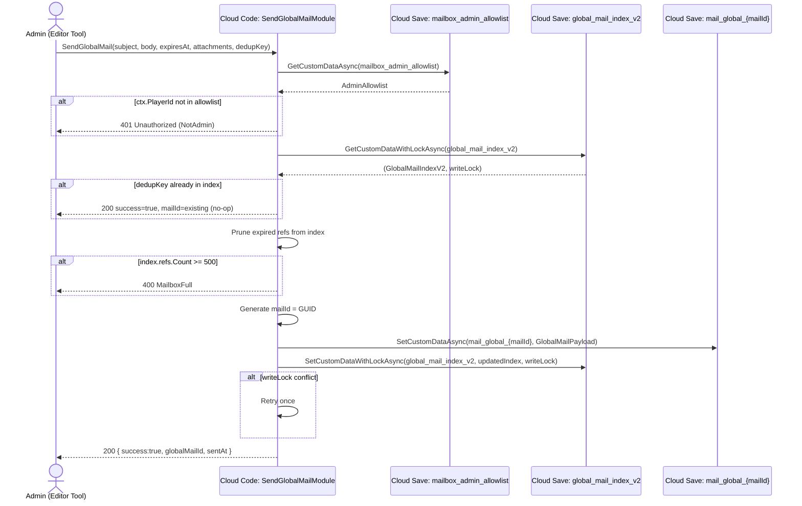
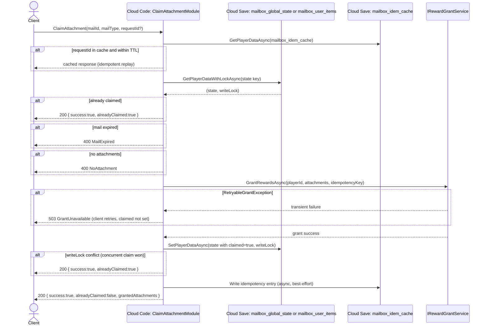
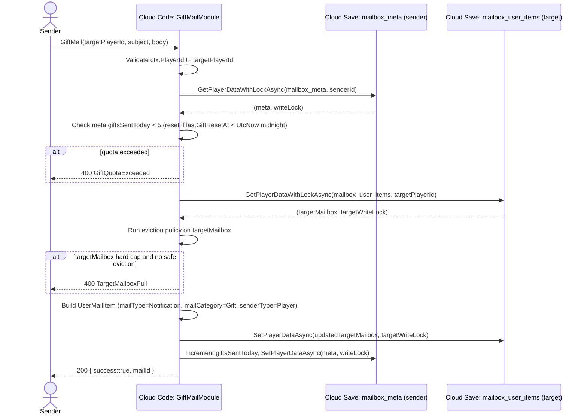

# Devlog_Mailbox_Production

## Status

- **Current phase:** Awaiting PO approval
- **Owner:** architect
- **Last updated:** 2026-05-28

---

## Problem & Product Goal

The existing mailbox (`feature/mailbox-cloudsave-system`) ships with nine production-blocking gaps:

| # | Problem | Severity |
|---|---------|----------|
| 1 | `global_mail_index` stores ALL global mail as one JSON blob — single Cloud Save key, unbounded growth, hard 5 MB ceiling | BLOCKER |
| 2 | No admin authorization — any authenticated player can call `SendGlobalMail` / `SendUserMail` | BLOCKER |
| 3 | `ClaimAttachment` performs Economy grant ONLY in Cloud Save (no actual Economy service call) | BLOCKER |
| 4 | `MarkRead` has no `writeLock` — not idempotent under concurrent calls, race possible | HIGH |
| 5 | User mailbox eviction silently drops the oldest mail (`RemoveAt(0)`) regardless of unclaimed rewards | HIGH |
| 6 | No pagination on `GetMailbox` — returns full list, fails at scale | HIGH |
| 7 | No `GiftMail`, `DeleteMail`, `ExpireMail`, or `PurgeExpired` operations | MEDIUM |
| 8 | No `MailType`, `MailCategory`, `SenderType` metadata — no filtering surface for client UI | MEDIUM |
| 9 | `MailboxIntegrationTest.cs` is a MonoBehaviour test harness — must be replaced with Editor tooling | MEDIUM |

**Product goal:** Harden the mailbox to production quality: data safety, economy integrity, admin access control, pagination, clean eviction, idempotent operations, and a developer Editor window to replace the MonoBehaviour test harness.

---

## Solution Direction

1. Shard the global mail index into a lightweight ref index (`global_mail_index_v2`) and per-mail payload keys (`mail_global_{mailId}`). Old `global_mail_index` remains read-only for one release as fallback.
2. Add admin authorization via a Cloud Save custom key `mailbox_admin_allowlist` (bootstrapped manually via UGS Dashboard).
3. Wire `ClaimAttachment` to an `IRewardGrantService` abstraction backed by `_gameApiClient` when the Economy SDK surface is available (it is currently absent from the `.csproj` — the abstraction is the seam).
4. Add `writeLock` to `MarkRead` and all state-mutating operations.
5. Implement safe eviction policy (expired-first, never drop unclaimed rewards).
6. Add pagination to `GetMailbox` and add `GetGlobalMails` / `GetUserMails` split.
7. Add `GiftMail`, `DeleteMail`, `PurgeExpired` endpoints.
8. Extend `MailboxModels.cs` with `MailType`, `MailCategory`, `SenderType`, `Sender` metadata.
9. Replace `MailboxIntegrationTest.cs` MonoBehaviour with an `MailboxAdminToolWindow.cs` Editor window plus Unity `[Test]` / `[UnityTest]` classes under `Tests/EditMode/` and `Tests/PlayMode/`.

---

## Scope

- Cloud Code module: 8 modules in `CloudCodeModule/BackpackAdventuresModule/Mailbox/`
- Cloud Save schema: 3 new keys, 3 modified keys (see Technical Design)
- CloudSaveHelper: 2 new helpers (`GetCustomDataWithLockAsync`, `SetPlayerDataBatchAsync`)
- Unity client: update `BackpackCloudCodeService.cs` to new API surface
- Editor tooling: `MailboxAdminToolWindow.cs` (replaces MonoBehaviour test harness)
- Test assets: `Tests/EditMode/MailboxModelsTests.cs`, `Tests/PlayMode/MailboxIntegrationTests.cs`
- Branch: `feature/mailbox-production` -> `develop` -> (DevOps promotes to `staging`)
- CI: existing `staging-deploy.yml` maintained; DevOps adds a post-deploy auto-test invocation step

## Non-Scope

- Push notifications on mail receipt (documented in `KNOWN_LIMITATIONS.md` — not this iteration)
- UGS Economy SDK upgrade (no Economy package in `.csproj` today; we design the abstraction seam only)
- Rate limiting beyond the admin allowlist gate
- Production `main` branch promotion (DevOps / release process handles this)
- Moving mailbox storage to a dedicated database (acceptable up to ~500 global mail payloads in Cloud Save)

---

## Technical Design

### Contract Changes vs Existing API

| Change | Old contract | New contract | Breaking? |
|--------|-------------|--------------|-----------|
| `GetMailbox` renamed to `GetUserMails` | `GetMailbox()` no args | `GetUserMails(page, pageSize)` | Yes — client update required |
| New `GetGlobalMails` endpoint | — | `GetGlobalMails(page, pageSize)` | Additive |
| `SendGlobalMail` now admin-gated | anyone | admin allowlist | Yes — client test code must use admin player |
| `SendUserMail` now admin-gated | anyone | admin allowlist | Yes |
| `ClaimAttachment` adds `requestId` idempotency key | not present | optional | Backward-compatible |
| `MarkMailRead` adds `writeLock` | no lock | writeLock on global state | Transparent to client |
| `MailAttachment.id` / `MailAttachment.amount` | client-only field names | unified to `itemId` / `quantity` (server-canonical) | Yes — client model update required |
| New `GiftMail`, `DeleteMail`, `PurgeExpired` | — | new endpoints | Additive |

---

### 5.1 Cloud Save Schema — New + Migration

All project-wide mailbox keys are in the **global_mail** Cloud Save custom data ID unless noted.

#### New keys

| Key | Scope | Access | Size bound | Content |
|-----|-------|--------|-----------|---------|
| `global_mail_index_v2` | Custom (project-wide) | Public read / CC write | ~200 refs × ~200 B = ~40 KB | `GlobalMailIndexV2` — lightweight ref list |
| `mail_global_{mailId}` | Custom (project-wide) | Public read / CC write | ~2–4 KB each | `GlobalMailPayload` — full mail content |
| `mailbox_admin_allowlist` | Custom (project-wide) | CC read only | < 1 KB | `AdminAllowlist` — player ID set |

#### Modified keys (schema extended, not replaced)

| Key | Change |
|-----|--------|
| `mailbox_user_items` | Add `mailType`, `mailCategory`, `senderType`, `sender`, `dedupKey` to each `UserMailItem`; version bump to 2 |
| `mailbox_global_state` | Prune dead IDs on write (expired global mail refs removed); version bump to 2 |
| `mailbox_meta` | Add `pendingRewardCount`, `lastPurgeAt`; version bump to 2 |

#### Deprecated key (read-only, one release)

| Key | Disposition |
|-----|------------|
| `global_mail_index` | Read-only fallback in `GetGlobalMails` for players with no `global_mail_index_v2` state yet. Write path uses only `global_mail_index_v2` and `mail_global_{mailId}` from day one. Removed in the subsequent release. |

#### JSON shapes

**`global_mail_index_v2` (custom, project-wide)**
```json
{
  "version": 2,
  "refs": [
    {
      "mailId": "gm_a1b2c3d4",
      "sentAt": "2026-05-28T10:00:00Z",
      "expiresAt": "2026-06-28T10:00:00Z",
      "version": 1
    }
  ]
}
```
Cap: 500 refs. On write, expired refs are pruned first. If cap exceeded after pruning, `SendGlobalMail` returns `MailboxFull` error.

**`mail_global_{mailId}` (custom, project-wide)**
```json
{
  "mailId": "gm_a1b2c3d4",
  "subject": "Maintenance Reward",
  "body": "Thank you for your patience.",
  "sentAt": "2026-05-28T10:00:00Z",
  "expiresAt": "2026-06-28T10:00:00Z",
  "mailType": "Attachment",
  "mailCategory": "Compensation",
  "senderType": "Admin",
  "sender": "GM_Ninh",
  "dedupKey": "maintenance-2026-05-28",
  "attachments": [
    { "itemId": "gold", "type": "currency", "quantity": 100 }
  ],
  "version": 1
}
```

**`mailbox_admin_allowlist` (custom, project-wide)**
```json
{
  "version": 1,
  "playerIds": ["player_admin_001", "player_admin_002"]
}
```
Bootstrapping: add player IDs manually via UGS Cloud Save Dashboard (Custom Data section). No UI to add admins through the game client — admin tool Editor window shows allowlist read-only; adding/removing requires Dashboard access.

**`mailbox_user_items` v2 (player-private)**
```json
{
  "version": 2,
  "mails": [
    {
      "mailId": "um_e5f6g7h8",
      "subject": "Daily Login Bonus",
      "body": "Day-7 reward.",
      "sentAt": "2026-05-28T08:00:00Z",
      "expiresAt": "2026-06-28T08:00:00Z",
      "isRead": false,
      "attachmentClaimed": false,
      "mailType": "Attachment",
      "mailCategory": "System",
      "senderType": "System",
      "sender": null,
      "dedupKey": "login-day7-2026-05-28",
      "attachments": [
        { "itemId": "chest_rare", "type": "item", "quantity": 1 }
      ]
    }
  ]
}
```

Eviction policy (enforced in `SendUserMail` before insert):
1. Remove all mails where `expiresAt < UtcNow` and `attachmentClaimed == true` or `attachments == null`.
2. Remove all mails where `expiresAt < UtcNow` and `isRead == true`.
3. Remove all mails where `expiresAt < UtcNow` (remaining expired, read state irrelevant — attachment is claimed or missing so safe to drop).
4. Remove oldest mail by `sentAt` where `attachmentClaimed == true`.
5. Remove oldest mail by `sentAt` where `attachments == null`.
6. If `Mails.Count >= hardCap (250)`: reject insert with `MailboxFull` error. NEVER drop unclaimed reward mail.

Soft cap = 200 (`MaxUserMailsStored`). Hard cap = 250 (`HardCapUserMailsStored`).

**`mailbox_global_state` v2 (player-private)**
```json
{
  "version": 2,
  "claimedIds": ["gm_a1b2c3d4"],
  "readIds": ["gm_a1b2c3d4"]
}
```
On every write, remove any ID not present in current `global_mail_index_v2.refs` (dead pruning).

**`mailbox_meta` v2 (player-private)**
```json
{
  "version": 2,
  "lastReadAt": "2026-05-28T09:00:00Z",
  "totalUserMails": 3,
  "totalGlobalMails": 1,
  "pendingRewardCount": 2,
  "lastPurgeAt": null
}
```

#### Migration plan

| Phase | Action |
|-------|--------|
| Release N (this sprint) | Write path uses `global_mail_index_v2` + `mail_global_{mailId}`. `GetGlobalMails` reads v2 first; if empty, falls back to old `global_mail_index` (read-only compat layer). |
| Release N+1 | Remove old `global_mail_index` fallback read from `GetGlobalMails`. Delete old key from Cloud Save Dashboard manually. |

No data migration script required. v2 is additive; players with existing v1 data see old mails via the compat layer until expiry.

---

### 5.2 Metadata Model

**`MailType` enum**

| Value | Meaning |
|-------|---------|
| `Notification` | No attachment; informational only |
| `Attachment` | Has one or more claimable items |

Required field on all mail items (no default). Backend rejects if absent.

**`MailCategory` enum**

| Value | Meaning |
|-------|---------|
| `System` | Automated system mail (daily login, event completion) |
| `Event` | Limited-time event reward |
| `Compensation` | Admin-issued compensation |
| `Gift` | Player-to-player gift |
| `Support` | CS team support resolution |
| `PatchNote` | Content patch notification |

Optional. Defaults to `System` if omitted.

**`SenderType` enum**

| Value | Meaning |
|-------|---------|
| `System` | Automated Cloud Code call |
| `Admin` | Admin player from allowlist |
| `Player` | Player-to-player gift sender |

Required on all mail items.

**`Sender` field**

Optional string. For `SenderType.Admin`: human-readable name (e.g., `"GM_Ninh"`). For `SenderType.System`: null. For `SenderType.Player`: sender's display name (provided by caller, not validated server-side in this iteration).

**Field requirements summary**

| Field | User mail | Global mail | Required? |
|-------|-----------|-------------|-----------|
| `mailId` | Yes | Yes | Yes — server-assigned |
| `subject` | Yes | Yes | Yes, 1–128 chars |
| `body` | Yes | Yes | Yes, 1–1024 chars |
| `sentAt` | Yes | Yes | Yes — server-assigned |
| `expiresAt` | Yes | Yes | Optional (null = no expiry) |
| `mailType` | Yes | Yes | Yes |
| `mailCategory` | Yes | Yes | Optional (default: System) |
| `senderType` | Yes | Yes | Yes |
| `sender` | Yes | Yes | Optional |
| `dedupKey` | Yes | Yes | Optional |
| `attachments[]` | Yes if Attachment | Yes if Attachment | Required when mailType=Attachment |
| `attachments[].itemId` | Yes | Yes | Required |
| `attachments[].type` | Yes | Yes | Required: `"currency"` or `"item"` |
| `attachments[].quantity` | Yes | Yes | Required, > 0 |

---

### 5.3 Permission Matrix

| API | Caller | Gate logic |
|-----|--------|------------|
| `GetUserMails(page, pageSize)` | Any authenticated player | `ctx.PlayerId` non-null |
| `GetGlobalMails(page, pageSize)` | Any authenticated player | `ctx.PlayerId` non-null |
| `MarkMailRead(mailId, mailType)` | Any authenticated player | `ctx.PlayerId` is owner of the mail |
| `MarkAllRead()` | Any authenticated player | `ctx.PlayerId` non-null |
| `ClaimAttachment(mailId, mailType, requestId?)` | Any authenticated player | `ctx.PlayerId` is owner; attachment unclaimed |
| `DeleteMail(mailId)` | Any authenticated player | `ctx.PlayerId` owns mail; mail is user mail only |
| `SendGlobalMail(...)` | Admin | `IsAdmin(ctx.PlayerId)` — checks `mailbox_admin_allowlist` |
| `SendUserMail(targetPlayerId, ...)` | Admin | `IsAdmin(ctx.PlayerId)` |
| `GiftMail(targetPlayerId, ...)` | Any authenticated player | `ctx.PlayerId` non-null; gift restrictions (see below) |
| `PurgeExpired()` | Admin | `IsAdmin(ctx.PlayerId)` |

**`IsAdmin` gate logic (pseudocode):**
```
allowlist = GetCustomDataAsync<AdminAllowlist>("mailbox_admin_allowlist")
if allowlist == null || !allowlist.PlayerIds.Contains(ctx.PlayerId):
    throw Unauthorized("NotAdmin")
```
Cache miss (allowlist key absent): treat as empty list → all admin calls rejected until allowlist is bootstrapped. This is intentional fail-closed behavior.

**GiftMail restrictions:**
- Sender != target player (no self-gift)
- `senderType` forced to `Player`; `mailCategory` forced to `Gift`
- No attachment items — gift is a notification only in this iteration (no economy transfer from player to player)
- Max 5 gifts per sender per 24-hour window (enforced via `mailbox_meta.giftsSentToday` counter reset by UTC midnight)

---

### 5.4 Reward Grant Flow

**`IRewardGrantService` abstraction**

The `Com.Unity.Services.CloudCode.Apis` package version `1.0.2-alpha` present in the `.csproj` exposes `IGameApiClient` with `CloudSaveData` only — no `Economy` or `Inventory` surface was found in the codebase (`grep EconomyApi` returns no matches). Therefore, economy grant is implemented behind an abstraction:

```csharp
// CloudCodeModule/BackpackAdventuresModule/Mailbox/IRewardGrantService.cs
public interface IRewardGrantService
{
    // Returns true on success. Throws RetryableGrantException on transient failure.
    Task<bool> GrantRewardsAsync(string playerId, IReadOnlyList<MailAttachment> attachments, string idempotencyKey);
}
```

**Default implementation in this sprint:** `CloudSaveRewardGrantService` — increments currency/item counts stored in a player Cloud Save key `player_wallet`. This is a placeholder that preserves the seam for a real Economy SDK swap later.

**TODO marker** in `BackpackAdventuresModule.csproj`:
```xml
<!-- TODO(economy): When Com.Unity.Services.Economy is available, replace CloudSaveRewardGrantService
     with EconomyRewardGrantService and wire IRewardGrantService in DI. -->
```

**ClaimAttachment server flow:**

1. Read `mailbox_global_state` (or `mailbox_user_items`) with `writeLock`.
2. If already claimed: return `AlreadyClaimed = true` immediately (no Economy call).
3. If expired: throw `MailExpired`.
4. If no attachments: throw `NoAttachment`.
5. Check idempotency store (see §5.8) — if `requestId` seen within TTL, return cached response.
6. Call `IRewardGrantService.GrantRewardsAsync(playerId, attachments, idempotencyKey)`.
7. On grant success: set `claimed = true`, write state with `writeLock` (conflict = both requests claimed simultaneously; the one that loses the write-lock returns `AlreadyClaimed`).
8. On `RetryableGrantException`: do NOT set `claimed = true`. Return `GrantUnavailable` error to client. Client retries.
9. On write-lock conflict after grant succeeds: the grant was issued but state write failed. Log warning. Return `AlreadyClaimed = true` (conservative — prevents double grant at cost of one confused response). This is the known at-most-once tradeoff.

---

### 5.5 Concurrency Strategy

**WriteLock matrix**

| Operation | WriteLock scope | Conflict resolution |
|-----------|----------------|---------------------|
| `ClaimAttachment` (global) | `mailbox_global_state` | 409 -> return `AlreadyClaimed` |
| `ClaimAttachment` (user) | `mailbox_user_items` | 409 -> return `AlreadyClaimed` |
| `MarkMailRead` (global) | `mailbox_global_state` | 409 -> retry once, then succeed silently (read is idempotent) |
| `MarkMailRead` (user) | `mailbox_user_items` | 409 -> retry once |
| `MarkAllRead` | `mailbox_meta` | 409 -> retry once |
| `SendUserMail` (insert) | `mailbox_user_items` | 409 -> retry once; if conflict again, fail with `Conflict` |
| `SendGlobalMail` (ref insert) | `global_mail_index_v2` | 409 -> retry once; fail with `Conflict` on second conflict |
| `DeleteMail` | `mailbox_user_items` | 409 -> retry once |
| `PurgeExpired` | `global_mail_index_v2` | 409 -> return `Conflict` (admin retries manually) |

**Conflict detection:** `IsWriteLockConflict(ex)` method already in `CloudSaveHelper.cs` — reuse unchanged.

**CloudSaveHelper additions required:**

| New helper | Signature | Purpose |
|------------|-----------|---------|
| `GetCustomDataWithLockAsync<T>` | Same shape as `GetPlayerDataWithLockAsync` but calls `GetCustomItemsAsync` | WriteLock on custom data keys |
| `SetCustomDataWithLockAsync<T>` | `(client, ctx, key, value, writeLock)` | Conditional write on custom data keys |

---

### 5.6 Pagination

Both `GetUserMails` and `GetGlobalMails` accept:

| Parameter | Type | Default | Max |
|-----------|------|---------|-----|
| `page` | int | 0 (0-based) | uncapped |
| `pageSize` | int | 20 | 50 |

Response shape:
```json
{
  "mails": [ /* MailItemDto[] */ ],
  "totalCount": 47,
  "page": 0,
  "pageSize": 20,
  "hasMore": true
}
```

Implementation: sort by `sentAt` descending in Cloud Code, then slice `[page * pageSize .. (page+1) * pageSize - 1]`. No cursor tokens — offset pagination is acceptable at expected mailbox sizes (< 500 items). `totalCount` is the filtered (non-expired) count before slicing.

Error cases: `pageSize > 50` -> `InvalidInput`. `page < 0` -> `InvalidInput`.

---

### 5.7 Eviction Policy

Applies when inserting into `mailbox_user_items`. Evaluated in priority order before insert:

| Priority | Condition | Action |
|----------|-----------|--------|
| 1 | `expiresAt < UtcNow AND attachmentClaimed == true` | Remove (safe, reward already issued) |
| 2 | `expiresAt < UtcNow AND attachments == null` | Remove (safe, notification-only expired) |
| 3 | `expiresAt < UtcNow AND isRead == true` | Remove (safe, read + expired) |
| 4 | `expiresAt < UtcNow` (any remaining) | Remove (expired — if unclaimed reward, log warning; attachment expired by admin choice) |
| 5 | `attachmentClaimed == true` (oldest by sentAt, not expired) | Remove if `Count >= softCap (200)` |
| 6 | `attachments == null` (oldest by sentAt, not expired) | Remove if `Count >= softCap (200)` |
| 7 | `Count >= hardCap (250)` | Reject insert: return `MailboxFull` |

Rule 4 note: admin-set expiry on an unclaimed reward is intentional — the admin accepted the risk when setting `expiresAt`. Cloud Code logs `LogWarning("Evicting unclaimed expired reward mail {mailId} for {playerId}")`.

NEVER evict a non-expired unclaimed reward mail unless hard cap is hit (and that is treated as a service error logged for investigation).

---

### 5.8 Idempotency

Applies to `ClaimAttachment` and `MarkMailRead`.

**Client provides optional `requestId` (GUID string).** If absent, server generates one internally (non-idempotent behavior preserved for backward compatibility — existing clients work without change).

**Idempotency store:** Cloud Save player-data key `mailbox_idem_cache`.

```json
{
  "version": 1,
  "entries": [
    {
      "requestId": "550e8400-e29b-41d4-a716-446655440000",
      "operation": "ClaimAttachment",
      "mailId": "um_e5f6g7h8",
      "resolvedAt": "2026-05-28T10:05:00Z",
      "responseSummary": { "success": true, "alreadyClaimed": false }
    }
  ]
}
```

TTL: 24 hours from `resolvedAt`. Entries older than 24 hours are pruned on each access. Max 50 entries (oldest pruned on overflow). This key is read/written WITHOUT writeLock (last-write-wins is acceptable for the idempotency cache — worst case: a retry is not deduplicated, which is safe since claim itself IS protected by writeLock).

---

### 5.9 Cleanup

**Lazy cleanup (existing, preserved):**
- `GetUserMails` prunes expired user mails in-band and rewrites the key.
- `SendGlobalMail` prunes expired refs from `global_mail_index_v2` on each write.

**Admin-triggered purge:**
- `PurgeExpired()` — admin-only. Reads `global_mail_index_v2`, removes all expired refs, deletes corresponding `mail_global_{mailId}` custom keys, writes back updated index. Intended for periodic maintenance.

**No background scheduler** in this iteration. UGS Cloud Code Scheduler module is a future option if background sweep is required.

---

### 5.10 Mermaid Sequence Diagrams

#### AdminSendGlobalMail



#### ClaimAttachment (with write-lock and Economy grant)



#### UserSendGiftMail



---

### 5.11 New API Endpoints Summary

| Function name | Caller | New? |
|--------------|--------|------|
| `GetUserMails` | Any player | Replaces `GetMailbox` |
| `GetGlobalMails` | Any player | New |
| `MarkMailRead` | Any player | Modified (+ writeLock) |
| `MarkAllRead` | Any player | Existing |
| `ClaimAttachment` | Any player | Modified (+ Economy seam + idempotency) |
| `DeleteMail` | Any player | New |
| `SendGlobalMail` | Admin | Modified (+ allowlist gate + v2 schema) |
| `SendUserMail` | Admin | Modified (+ allowlist gate + metadata) |
| `GiftMail` | Any player | New |
| `PurgeExpired` | Admin | New |

---

## Implementation Plan

| Step | Task | Files to create / modify | Output | Status |
|------|------|--------------------------|--------|--------|
| 1 | Create feature branch `feature/mailbox-production` | git | Branch | Pending |
| 2 | Extend `MailboxModels.cs` with new enums, v2 models, idempotency types, v2 constants | `Mailbox/MailboxModels.cs` | Compiling models | Pending |
| 3 | Extend `CloudSaveHelper.cs` with `GetCustomDataWithLockAsync`, `SetCustomDataWithLockAsync` | `Mailbox/CloudSaveHelper.cs` | 2 new helpers | Pending |
| 4 | Implement `IRewardGrantService` + `CloudSaveRewardGrantService` | `Mailbox/IRewardGrantService.cs`, `Mailbox/CloudSaveRewardGrantService.cs` | Economy seam | Pending |
| 5 | Refactor `SendMailModule.cs` → split into `SendGlobalMailModule.cs` + `SendUserMailModule.cs` + `GiftMailModule.cs` | Delete `SendMailModule.cs`; create 3 new files | v2 send modules | Pending |
| 6 | Refactor `GetMailboxModule.cs` → `GetUserMailsModule.cs` + `GetGlobalMailsModule.cs` | Delete `GetMailboxModule.cs`; create 2 new files | Pagination support | Pending |
| 7 | Refactor `MarkReadModule.cs` → add writeLock, add `MarkAllRead` | `Mailbox/MarkReadModule.cs` | Idempotent mark-read | Pending |
| 8 | Refactor `ClaimAttachmentModule.cs` → Economy seam + idempotency store | `Mailbox/ClaimAttachmentModule.cs` | Safe claim | Pending |
| 9 | Implement `DeleteMailModule.cs` | `Mailbox/DeleteMailModule.cs` | User mail delete | Pending |
| 10 | Implement `PurgeExpiredModule.cs` | `Mailbox/PurgeExpiredModule.cs` | Admin purge | Pending |
| 11 | Update `BackpackCloudCodeService.cs` for new API surface | `UnityClient/Runtime/BackpackCloudCodeService.cs` | Updated client | Pending |
| 12 | Create `MailboxAdminToolWindow.cs` Editor window (replaces MonoBehaviour) | `UnityClient/Editor/MailboxAdminToolWindow.cs` | Editor tool | Pending |
| 13 | Create EditMode tests | `UnityClient/Tests/EditMode/MailboxModelsTests.cs` | Unit tests | Pending |
| 14 | Create PlayMode integration tests | `UnityClient/Tests/PlayMode/MailboxIntegrationTests.cs` | Integration tests | Pending |
| 15 | Delete `MailboxIntegrationTest.cs` MonoBehaviour | Delete `UnityClient/Tests/MailboxIntegrationTest.cs` | Removed | Pending |
| 16 | DevOps: add post-deploy test invocation to `staging-deploy.yml` | `.github/workflows/staging-deploy.yml` | CI update | Pending |
| 17 | Update `MailboxConstants.cs` (new key constants, caps) | `Mailbox/MailboxModels.cs` | Updated constants | Pending |
| 18 | Update `API_CONTRACTS.md` and `MAILBOX_BACKEND_ARCHITECTURE.md` | `docs/` | Updated docs | Pending |

---

## Model & Resource Allocation

| Phase | Model / Agent | Reason |
|-------|---------------|--------|
| Architecture, design, Devlog | Opus-level (architect) | High-stakes correctness decisions |
| Backend Cloud Code implementation (Steps 2–10) | Sonnet executor (unity-dev) | Mechanical implementation against approved spec |
| Client tooling + Editor window (Steps 11–12) | Sonnet executor (data-tool) | Unity Editor API work |
| Test implementation (Steps 13–15) | Sonnet executor (tester) | Structured from test matrix |
| CI/DevOps update (Steps 16) | Sonnet executor (devops) | YAML authoring |
| Final review | Opus-level (architect) | Sign-off against acceptance criteria |

---

## Agent Allocation

### Agent 1: Backend Implementer (`unity-dev`)

| Field | Detail |
|-------|--------|
| **Role** | Cloud Code C# module implementer |
| **Model** | Sonnet executor |
| **Responsibility** | Implement Steps 2–10 (all `.cs` files under `CloudCodeModule/BackpackAdventuresModule/Mailbox/`) |
| **Context Package** | See below |
| **Acceptance criteria** | All 10 endpoints compile cleanly; `IsAdmin` gate present on admin functions; `writeLock` used on all state-mutating writes; eviction policy matches §5.7 exactly; `IRewardGrantService` called in `ClaimAttachment` with no Economy call bypassing it; `requestId` idempotency check present; v2 schema keys used exclusively for writes; old `global_mail_index` read-compat layer present but write path never touches it |

**Context Package — Backend Implementer:**
```
Requirement: Implement the 10 Cloud Code endpoints defined in Devlog_Mailbox_Production.md §5.1–5.9.
Key files to read first: 
  CloudCodeModule/BackpackAdventuresModule/Mailbox/MailboxModels.cs
  CloudCodeModule/BackpackAdventuresModule/Mailbox/CloudSaveHelper.cs
  CloudCodeModule/BackpackAdventuresModule/Mailbox/ClaimAttachmentModule.cs
  CloudCodeModule/BackpackAdventuresModule/Mailbox/SendMailModule.cs
Key files to CREATE:
  Mailbox/SendGlobalMailModule.cs, Mailbox/SendUserMailModule.cs, Mailbox/GiftMailModule.cs
  Mailbox/GetUserMailsModule.cs, Mailbox/GetGlobalMailsModule.cs
  Mailbox/DeleteMailModule.cs, Mailbox/PurgeExpiredModule.cs
  Mailbox/IRewardGrantService.cs, Mailbox/CloudSaveRewardGrantService.cs
Key files to MODIFY:
  Mailbox/MailboxModels.cs (add enums, v2 models, new constants)
  Mailbox/CloudSaveHelper.cs (add GetCustomDataWithLockAsync, SetCustomDataWithLockAsync)
  Mailbox/ClaimAttachmentModule.cs (add IRewardGrantService call, idempotency)
  Mailbox/MarkReadModule.cs (add writeLock, MarkAllRead)
Key files to DELETE: Mailbox/SendMailModule.cs, Mailbox/GetMailboxModule.cs
What NOT to change: .csproj NuGet references (no Economy SDK in scope), .github/workflows/staging-deploy.yml, any file outside CloudCodeModule/
Approved design: Devlog §5.1–5.9 (schema, permission matrix, reward flow, concurrency, pagination, eviction, idempotency)
Project rules:
  - Namespace: BackpackAdventures.CloudCode
  - Each module: one [CloudCodeFunction] attribute per class, constructor-injected IExecutionContext + IGameApiClient + ILogger<T>
  - Follow HealthCheckModule.cs pattern
  - All string input validation: throw ArgumentException(MailboxError.InvalidInput) for bad input
  - Never trust ctx.PlayerId from client payload
  - writeLock via CloudSaveHelper.GetPlayerDataWithLockAsync / SetPlayerDataAsync(writeLock)
```

---

### Agent 2: Client Tooling Engineer (`data-tool`)

| Field | Detail |
|-------|--------|
| **Role** | Unity Editor window + client service wrapper |
| **Model** | Sonnet executor |
| **Responsibility** | Steps 11–12: update `BackpackCloudCodeService.cs` for new API surface; create `MailboxAdminToolWindow.cs` Editor window |
| **Context Package** | See below |
| **Acceptance criteria** | `BackpackCloudCodeService.cs` exposes `GetUserMailsAsync(page, pageSize)`, `GetGlobalMailsAsync(page, pageSize)`, `ClaimAttachmentAsync(mailId, mailType, requestId?)`, `SendGlobalMailAsync(...)` with new metadata params, `GiftMailAsync(...)`, `DeleteMailAsync(mailId)`, `PurgeExpiredAsync()`; Editor window has panels for: SendGlobalMail, SendUserMail, GetGlobalMails (paginated), GetUserMails (paginated), PurgeExpired; window reads allowlist and displays it read-only; all Cloud Code calls use `CallModuleEndpointAsync` with correct function names; no MonoBehaviour; no `new` keyword for service instantiation |

**Context Package — Client Tooling Engineer:**
```
Requirement: Update client wrapper and create Editor admin tool per Devlog_Mailbox_Production.md §Implementation Plan Steps 11–12.
Key files to read first:
  UnityClient/Runtime/BackpackCloudCodeService.cs
  UnityClient/Tests/MailboxIntegrationTest.cs (read only — understand existing patterns, DO NOT modify)
Key file to MODIFY:
  UnityClient/Runtime/BackpackCloudCodeService.cs
Key file to CREATE:
  UnityClient/Editor/MailboxAdminToolWindow.cs
What NOT to change:
  CloudCodeModule/ (any server .cs file)
  .github/workflows/staging-deploy.yml
  Any .meta file
New API surface (function names as called via CloudCodeService.Instance.CallModuleEndpointAsync):
  "GetUserMails"      input: { page, pageSize }
  "GetGlobalMails"    input: { page, pageSize }
  "MarkMailRead"      input: { mailId, mailType }
  "MarkAllRead"       input: none
  "ClaimAttachment"   input: { mailId, mailType, requestId? }
  "DeleteMail"        input: { mailId }
  "SendGlobalMail"    input: { subject, body, expiresAt?, mailCategory?, senderName?, dedupKey?, attachments? }
  "SendUserMail"      input: { targetPlayerId, subject, body, expiresAt?, mailCategory?, senderName?, dedupKey?, attachments? }
  "GiftMail"          input: { targetPlayerId, subject, body }
  "PurgeExpired"      input: none
Editor window requirements:
  - Inherits EditorWindow; menu item "BackpackAdventures/Mailbox Admin Tool"
  - Uses UniTask or async/await (no coroutines)
  - Each panel calls the service wrapper and displays result in scrollable label
  - SendGlobalMail panel: fields for subject, body, expiresAt, attachments (JSON text area), dedupKey
  - Read allowlist panel: calls GetCustomDataAsync on mailbox_admin_allowlist and displays playerIds list
Module name constant: "BackpackAdventuresModule" (already in BackpackCloudCodeService.cs)
```

---

### Agent 3: QA / Tester (`tester`)

| Field | Detail |
|-------|--------|
| **Role** | Test implementation |
| **Model** | Sonnet executor |
| **Responsibility** | Steps 13–15: create `MailboxModelsTests.cs` (EditMode), `MailboxIntegrationTests.cs` (PlayMode), delete `MailboxIntegrationTest.cs` |
| **Context Package** | See below |
| **Acceptance criteria** | All test cases from the Testing Plan §below are implemented by name; EditMode tests have no UGS dependency; PlayMode tests use `[UnityTest]` with `IEnumerator` + `UniTask.ToCoroutine()`; race condition test fires two concurrent `ClaimAttachment` calls and asserts `successCount == 1`; admin-gated tests sign in as admin player from `TestConstants.AdminPlayerId`; no test uses `MonoBehaviour` as base class |

**Context Package — QA / Tester:**
```
Requirement: Implement tests from Testing Plan in Devlog_Mailbox_Production.md.
Key files to read first:
  UnityClient/Tests/MailboxIntegrationTest.cs (pattern reference — THIS FILE WILL BE DELETED after new tests pass)
  UnityClient/Runtime/BackpackCloudCodeService.cs (after client tooling update)
  CloudCodeModule/BackpackAdventuresModule/Mailbox/MailboxModels.cs (after backend update)
Key files to CREATE:
  UnityClient/Tests/EditMode/MailboxModelsTests.cs
  UnityClient/Tests/PlayMode/MailboxIntegrationTests.cs
  UnityClient/Tests/TestConstants.cs (admin player ID, target player ID constants)
Key file to DELETE:
  UnityClient/Tests/MailboxIntegrationTest.cs
What NOT to change:
  CloudCodeModule/ (any .cs file)
  BackpackCloudCodeService.cs
  .github/workflows/staging-deploy.yml
Test entry point for DevOps CI invocation:
  PlayMode test suite name: "BackpackAdventures.CloudCode.Client.Tests.MailboxIntegrationTests"
  DevOps will call: ugs cloud-code run BackpackAdventuresModule HealthCheck (smoke) + Unity Test Runner CLI
```

---

### Agent 4: DevOps (`devops`)

| Field | Detail |
|-------|--------|
| **Role** | CI pipeline maintainer |
| **Model** | Sonnet executor |
| **Responsibility** | Step 16: add post-deploy smoke test step to `staging-deploy.yml`; document the test entry point |
| **Context Package** | See below |
| **Acceptance criteria** | `staging-deploy.yml` gains one new step after "Verify deployment" that calls `HealthCheck` via `ugs cloud-code run`; step name is "Post-deploy smoke test"; step is `continue-on-error: false`; no existing steps are modified or removed; no new GitHub secrets added |

**Context Package — DevOps:**
```
Requirement: Add post-deploy smoke test step to existing CI workflow.
Key file to MODIFY:
  Assets/UnityCloudCode/.github/workflows/staging-deploy.yml
What NOT to change:
  Any step before or including "Verify deployment"
  Any CloudCodeModule .cs file
  Any Unity client .cs file
New step to add (after "Verify deployment", before "Write job summary"):
  Name: "Post-deploy smoke test"
  Command: ugs cloud-code run BackpackAdventuresModule HealthCheck \
    --project-id ${{ secrets.UNITY_PROJECT_ID }} \
    --environment-name ${{ secrets.UNITY_ENVIRONMENT }}
  The command should assert success=true in output; fail the step if not.
  Use: if ! ugs cloud-code run ... | grep -q '"success":true'; then exit 1; fi
  continue-on-error: false
Git branch model:
  feature/mailbox-production -> develop -> staging (auto-deploys)
  DevOps creates feature/mailbox-production branch from current develop
  PR goes to develop; develop is promoted to staging by DevOps
```

---

## Testing Plan

### Positive Tests

| ID | Test name | Pre-condition | Expected outcome |
|----|-----------|--------------|-----------------|
| P01 | SendGlobalMail_AdminOnly_Succeeds | Caller is admin player | `success=true`, `globalMailId` non-empty, ref in `global_mail_index_v2` |
| P02 | SendGlobalMail_WithAttachment_Succeeds | Admin caller, valid attachment | `success=true`; `mail_global_{id}` key exists with attachment |
| P03 | SendUserMail_AdminOnly_Succeeds | Admin caller, valid targetPlayerId | `success=true`, mail in target's `mailbox_user_items` |
| P04 | GetGlobalMails_ReturnsPaginatedResults | 3 global mails exist | Page 0, pageSize 2 returns `mails.Count=2`, `hasMore=true`, `totalCount=3` |
| P05 | GetUserMails_ReturnsPaginatedResults | 5 user mails exist | Page 1, pageSize 3 returns 2 mails, `hasMore=false` |
| P06 | GetGlobalMails_ExpiredMailsFiltered | 1 expired + 1 active global mail | Response contains only active mail |
| P07 | MarkMailRead_User_Idempotent | User mail exists, unread | First call: `success=true, isRead=true`. Second call: same response, no error |
| P08 | MarkAllRead_SetsLastReadAt | Multiple unread mails | `mailbox_meta.lastReadAt` updated; subsequent GetUserMails shows all old mails as read |
| P09 | ClaimAttachment_Global_GrantsReward | Global mail with attachment, unclaimed | `success=true, alreadyClaimed=false`, reward in `player_wallet` (via `CloudSaveRewardGrantService`) |
| P10 | ClaimAttachment_User_GrantsReward | User mail with attachment, unclaimed | Same as P09; `mailbox_user_items` mail has `attachmentClaimed=true` |
| P11 | ClaimAttachment_Idempotent_AlreadyClaimed | Claim P09 mail again | `success=true, alreadyClaimed=true`; reward NOT granted twice |
| P12 | ClaimAttachment_WithRequestId_Replays | Claim with `requestId=X`; retry with same `requestId=X` | Both responses identical; grant called exactly once |
| P13 | DeleteMail_UserMail_Succeeds | User mail, no unclaimed attachment | `success=true`; mail absent from next `GetUserMails` |
| P14 | GiftMail_Succeeds | Sender != target, quota not exceeded | `success=true`; mail in target's `mailbox_user_items` with `mailCategory=Gift` |
| P15 | PurgeExpired_Admin_RemovesExpiredRefs | 2 expired global mails | Both refs removed from `global_mail_index_v2`; `mail_global_{id}` keys deleted |
| P16 | SendGlobalMail_DedupKey_Idempotent | `dedupKey="dup-test"` sent twice | Second call returns `success=true` with same `globalMailId`, no duplicate in index |

### Negative Tests

| ID | Test name | Input | Expected outcome |
|----|-----------|-------|-----------------|
| N01 | SendGlobalMail_NonAdmin_Rejected | Non-admin `ctx.PlayerId` | `401 Unauthorized (NotAdmin)` |
| N02 | SendUserMail_NonAdmin_Rejected | Non-admin caller | `401 Unauthorized (NotAdmin)` |
| N03 | SendGlobalMail_EmptySubject | `subject=""` | `InvalidInput` error |
| N04 | SendGlobalMail_SubjectTooLong | `subject` = 129 chars | `InvalidInput` error |
| N05 | SendGlobalMail_BodyTooLong | `body` = 1025 chars | `InvalidInput` error |
| N06 | ClaimAttachment_InvalidMailId | `mailId="nonexistent-000"` | `MailNotFound` error |
| N07 | ClaimAttachment_NoAttachment | Mail with `mailType=Notification` | `NoAttachment` error |
| N08 | ClaimAttachment_ExpiredMail | Mail with `expiresAt` in past | `MailExpired` error |
| N09 | DeleteMail_WithUnclaimedReward_Rejected | Mail with `attachmentClaimed=false` and non-null `attachments` | `CannotDeleteUnclaimedReward` error |
| N10 | DeleteMail_GlobalMail_Rejected | `mailId` of a global mail | `CannotDeleteGlobal` error |
| N11 | GetUserMails_PageSizeOver50 | `pageSize=51` | `InvalidInput` error |
| N12 | GiftMail_ToSelf_Rejected | `targetPlayerId == ctx.PlayerId` | `InvalidInput` error (no self-gift) |
| N13 | GiftMail_QuotaExceeded | 5 gifts already sent today | `GiftQuotaExceeded` error |
| N14 | PurgeExpired_NonAdmin_Rejected | Non-admin caller | `401 Unauthorized (NotAdmin)` |
| N15 | AdminAllowlist_Missing_AllAdminCallsRejected | `mailbox_admin_allowlist` key absent | All admin calls return `401 Unauthorized (NotAdmin)` |

### Concurrency Tests

| ID | Test name | Setup | Expected outcome |
|----|-----------|-------|-----------------|
| C01 | ClaimAttachment_ConcurrentDoubleFire | Two simultaneous `ClaimAttachment` for same `mailId` | Exactly `successCount == 1`; reward granted once |
| C02 | MarkMailRead_ConcurrentDoubleFire | Two simultaneous `MarkMailRead` for same `mailId` | Both return `success=true`; mail is read once (no duplicate `readIds`) |
| C03 | SendGlobalMail_ConcurrentAdmins | Two admin calls simultaneously | Both succeed with different `globalMailId`; index has exactly 2 new refs |
| C04 | ClaimAttachment_ConcurrentDifferentMails | Two concurrent claims for different `mailId` | Both succeed independently |

### Reliability Tests

| ID | Test name | Setup | Expected outcome |
|----|-----------|-------|-----------------|
| R01 | GetUserMails_FreshPlayer_EmptyList | Player with no mails | `success=true, mails=[], totalCount=0, hasMore=false` |
| R02 | EvictionPolicy_NeverDropUnclaimedReward | Mailbox at softCap (200) with mix of claimed/unclaimed | Insert succeeds; only safe mails evicted; unclaimed reward mails preserved |
| R03 | EvictionPolicy_HardCapRejectsBeyond250 | 250 mails, all unclaimed rewards | Insert returns `MailboxFull` |
| R04 | GlobalMailIndexV2_LegacyFallback | `global_mail_index_v2` absent, `global_mail_index` v1 exists | `GetGlobalMails` returns v1 mails via compat layer |
| R05 | IdempotencyCache_PrunesOldEntries | Cache has 50 entries + 1 new | Oldest entry pruned; new entry stored |
| R06 | WriteLockConflict_MarkRead_RetriesAndSucceeds | Simulate 409 on first write | Second attempt succeeds; mail marked read |

---

## Execution Notes

_(empty — to be filled during implementation)_

---

## Verification Results

_(empty — to be filled after QA run)_

---

## Verification Fallbacks

If Unity MCP or UGS live backend is unavailable during verification:
- Record failure with timestamp in this section.
- Fall back to static code review of modules against permission matrix and concurrency strategy.
- Product Owner performs manual verification via Editor tool and UGS Dashboard Cloud Save inspection.

---

## Issues & Risks

| Risk | Likelihood | Impact | Mitigation |
|------|-----------|--------|-----------|
| `IGameApiClient` Economy surface absent — `Com.Unity.Services.CloudCode.Apis v1.0.2-alpha` has no Economy API | Confirmed (grep returned no matches) | HIGH — real currency grant blocked | Use `IRewardGrantService` / `CloudSaveRewardGrantService` as seam; add TODO marker in `.csproj`; swap in when SDK upgrades |
| WriteLock TTL — Cloud Save writeLock expiry time is undocumented in `1.0.2-alpha` SDK | Medium | MEDIUM — stale locks could block writes | If 409 conflicts persist beyond one retry, surface `Conflict` error and have client retry with exponential back-off; log all conflicts |
| Admin allowlist bootstrap — allowlist key must be created manually in UGS Dashboard before any admin calls work | Certain (by design) | HIGH on first deploy | Document exact bootstrap steps in `DEPLOYMENT.md`; add step to `staging-deploy.yml` summary; until bootstrapped, all admin calls return 401 (fail-closed is correct) |
| `MailboxIntegrationTest.cs` deletion ordering — if QA deletes before new tests pass, we lose test coverage temporarily | Low | MEDIUM | Delete step 15 is last; QA must confirm all new tests pass before deleting the old file |
| GitHub Actions secrets for staging-deploy — `UNITY_SERVICE_ACCOUNT_KEY` and `UNITY_SERVICE_ACCOUNT_SECRET` rotate; if rotated mid-sprint the post-deploy test step will fail | Low | LOW (CI only, not production) | Follow existing rotation procedure in `CICD.md`; new step uses same secrets, no new secrets needed |
| Cloud Save custom key `mail_global_{mailId}` — `SetCustomItemAsync` uses `GlobalCustomId = "global_mail"`; if UGS Dashboard custom data ID differs, all writes fail | Medium | HIGH | Verify custom data ID in UGS Dashboard before first deploy; if different, update `CloudSaveHelper.GlobalCustomId` constant |
| `global_mail_index_v2` cap of 500 refs — if event mailing volume exceeds 500 active global mails simultaneously | Very Low | MEDIUM | Prune expired on every write; 500 active simultaneous global mails is an extreme case; add monitoring metric in future |

---

## Lessons Learned

_(empty — to be filled at retrospective)_

---

## Final State

_(empty — to be filled after PO final review)_
